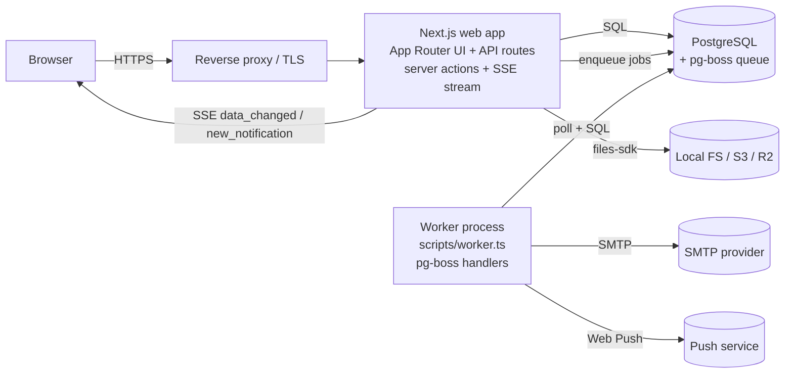
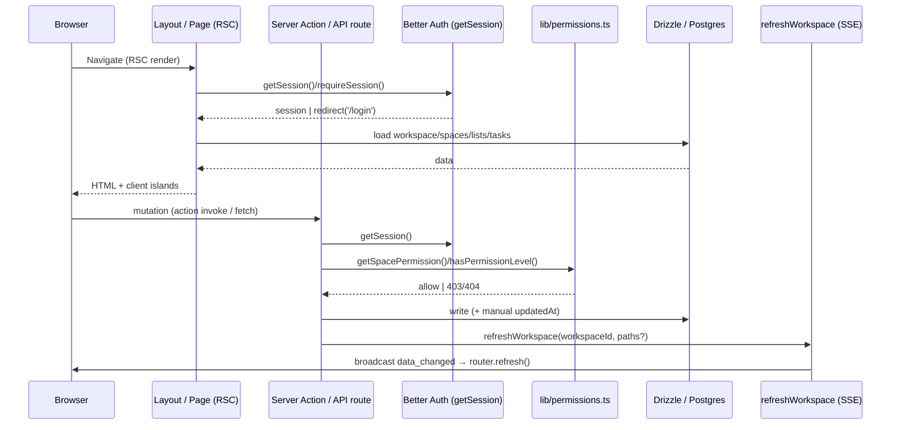
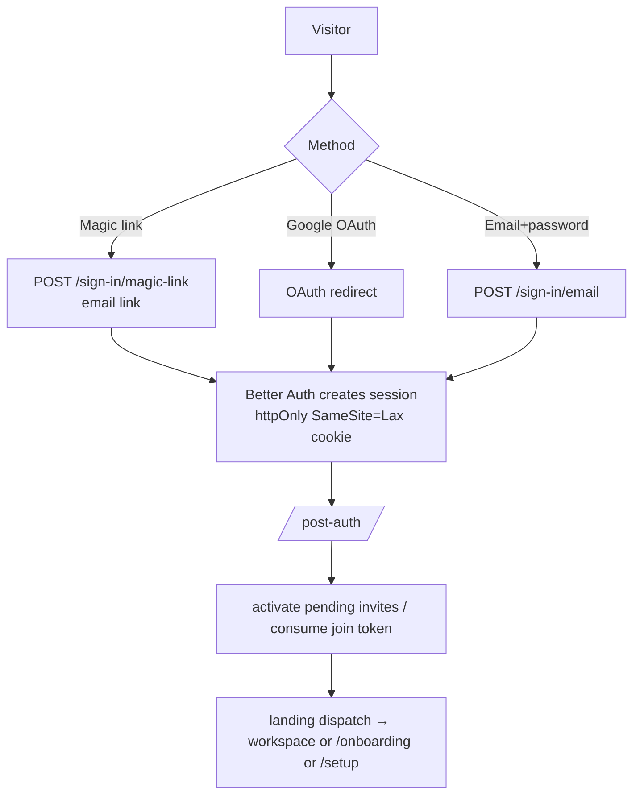
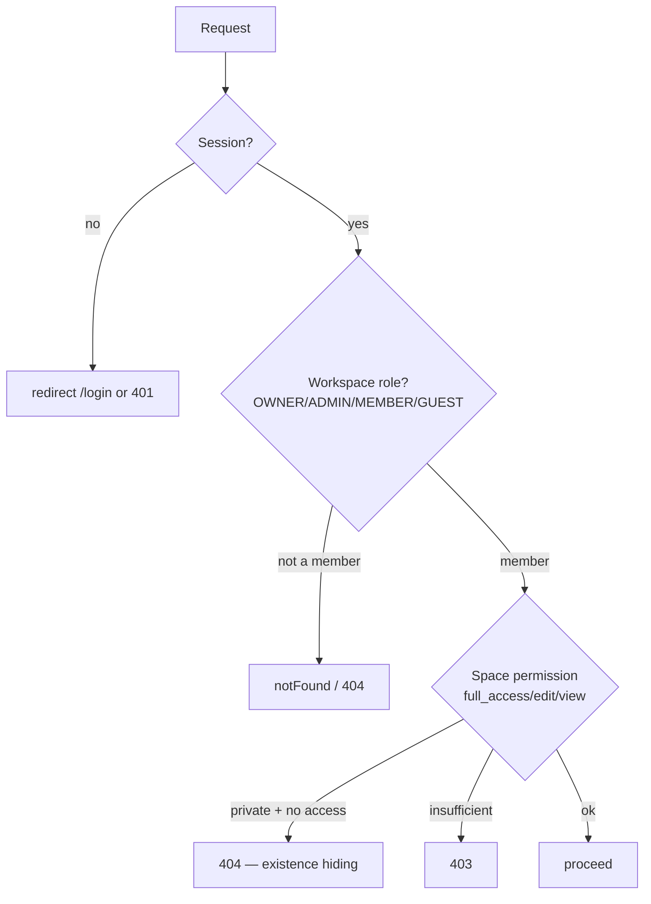
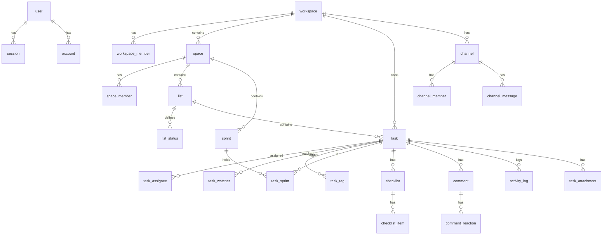
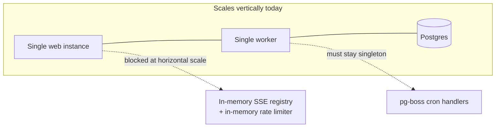

# Kanbanica — Production Review

> **Scope:** Full-application production review of the `main` branch, generated for a senior-engineer audience. It is intended to be read **without** opening the codebase, while citing real files/modules so any claim can be verified.
>
> **Method:** Static read-only analysis of the repository (source, schema, migrations, config, Docker, CI). No code was modified. Findings are based only on what exists in the tree; anything absent is marked **"Not Implemented."**
>
> **Repo snapshot:** ~58,000 LOC across [app/](app/), [components/](components/), [lib/](lib/), [db/](db/), [server/](server/). Package `kanbanica` v0.1.0, MIT-licensed, self-hostable.

---

## Table of Contents

1. [Executive Summary](#1-executive-summary) · 2. [Project Structure](#2-project-structure) · 3. [Tech Stack](#3-tech-stack) · 4. [Application Architecture](#4-application-architecture) · 5. [Feature Inventory](#5-feature-inventory) · 6. [Routing](#6-routing) · 7. [Database](#7-database) · 8. [API Documentation](#8-api-documentation) · 9. [Authentication & Authorization](#9-authentication--authorization) · 10. [Environment Variables](#10-environment-variables) · 11. [Third-Party Integrations](#11-third-party-integrations) · 12. [Code Quality Review](#12-code-quality-review) · 13. [Performance Review](#13-performance-review) · 14. [Security Audit](#14-security-audit) · 15. [Error Handling](#15-error-handling) · 16. [Production Readiness Checklist](#16-production-readiness-checklist) · 17. [Scalability Review](#17-scalability-review) · 18. [Deployment Review](#18-deployment-review) · 19. [Dependencies](#19-dependencies) · 20. [Testing](#20-testing) · 21. [Accessibility](#21-accessibility) · 22. [SEO](#22-seo) · 23. [UX Review](#23-ux-review) · 24. [Technical Debt](#24-technical-debt) · 25. [Known Risks](#25-known-risks) · 26. [Missing Features](#26-missing-features) · 27. [Production Improvement Roadmap](#27-production-improvement-roadmap) · 28. [Overall Scorecard](#28-overall-scorecard) · 29. [Final Recommendation](#29-final-recommendation)

---

## 1. Executive Summary

### Purpose

Kanbanica is a **self-hostable, ClickUp-style project-management SaaS**. Teams organize work in a hierarchy of **Workspace → Project (Space) → List / Sprint → Task**, with real-time collaboration, notifications, and a keyboard-first UI. It is explicitly positioned as a "complete, production-grade codebase you can clone, run, extend, and deploy on your own infrastructure" ([README.md](README.md)).

### Primary Features

Workspaces & members, Projects (Spaces) with per-project privacy/permissions, Lists with custom statuses, Sprints (planning, story points, auto-close), rich Tasks (assignees, watchers, priorities, due-date ranges, subtasks, checklists, dependencies, tags, attachments, Tiptap descriptions), Board/List/Calendar/My-Tasks views, comments with @mentions/reactions/activity feed, team **Channels** (chat), **Notifications** (in-app + email digests + Web Push), **real-time sync** over SSE, **two-level permissions** (workspace role + project permission) with guests, three login methods on one account, a **customer-support** system (tickets + help center), and a **platform admin panel** ("Orbit") with impersonation, ban/unban, audit log, and analytics.

### Current Development Status

**Pre-1.0 (v0.1.0), feature-complete for its MVP scope, actively developed.** Recent commits show ongoing UX polish (search UX, global keyboard shortcuts, filtering UI). The product surface is broad and coherent, but automated test coverage is still **minimal** (a Vitest suite now exists but covers only the authorization core — see [§20](#20-testing)), there are **no security headers**, and a couple of **half-finished/legacy surfaces** remain (a `/dashboard` scaffold and two parallel admin UIs). It is well past prototype but not yet hardened for untrusted-multi-tenant production.

### Technology Stack (one-liner)

Next.js 16 (App Router, standalone output) + React 19 + TypeScript on PostgreSQL via Drizzle ORM, Better Auth for identity, Tailwind v4 + shadcn/Radix for UI, Tiptap for rich text, pg-boss for background jobs, SSE for realtime, Nodemailer for email, files-sdk (local FS → S3/R2) for storage. See [§3](#3-tech-stack).

### Overall Architecture (one-liner)

**Two long-running processes** — a Next.js web app and a pg-boss worker — sharing **one PostgreSQL database** (which also hosts the job queue). See [§4](#4-application-architecture) and [ARCHITECTURE.md](ARCHITECTURE.md).

### Estimated Production Readiness: **~70%**

Strong architecture, data model, and DX; held back by the absence of tests, security headers/CSP, a stored-XSS attachment vector, single-instance-only realtime/rate-limiting, and no external observability. Suitable today for **trusted internal / small-team self-hosting**; needs work before untrusted public multi-tenant use.

### Biggest Strengths

1. **Clean, well-documented two-process architecture** with a disciplined mutation→realtime convention ([lib/realtime/refresh.ts](lib/realtime/refresh.ts)) and a durable, idempotent email outbox.
2. **Thoughtful data model** — 47 tables, sensible cascades, hot-path indexes, soft-delete pattern, and a production-safe migrator using an advisory lock ([scripts/migrate.ts](scripts/migrate.ts)).
3. **Solid auth foundations** — Better Auth with fresh-DB role/ban re-checks, invite-only-by-default, 404-not-403 existence hiding, and constant-time webhook comparison.
4. **Excellent operator/developer documentation** — [ARCHITECTURE.md](ARCHITECTURE.md), [DEPLOYMENT.md](DEPLOYMENT.md), [SETUP.md](SETUP.md), [CLAUDE.md](CLAUDE.md), and a full per-feature `docs/` set.
5. **Rich-text stored as Tiptap JSON, not HTML** — structurally neutralizes the most common XSS class.

### Biggest Weaknesses

1. **Growing but still narrow automated test coverage** ([§20](#20-testing)) — a Vitest suite now gates CI with 257 cases across 20 files (authorization incl. `authz.ts`/`admin-auth.ts`, pure utilities, notifications/email, sprint/worker jobs), but `app/`, `components/`, most of `lib/`, and every integration path remain untested.
2. **No security headers / CSP** and a **stored-XSS-capable attachment path** (SVG served inline, unrestricted non-inline MIME) ([§14](#14-security-audit)).
3. **Single-instance ceilings**: in-memory SSE registry and in-memory rate limiter don't survive horizontal scaling ([§17](#17-scalability-review)).
4. **No external observability** (no error tracking / metrics / APM) ([§15](#15-error-handling)).
5. **Loose ends**: dual admin surfaces, a `/dashboard` scaffold, a broken `scripts/check-db.mjs`, and stale docs ([§24](#24-technical-debt)).

---

## 2. Project Structure

```
Kanbanica/
├── app/                     Next.js App Router (pages, layouts, API routes, server actions)
│   ├── (auth)/              Unauthenticated: login, signup, forgot/reset password
│   ├── (app)/               Authenticated product, workspace-scoped routes
│   │   └── [workspaceId]/   Workspace shell → [spaceId] → list/[listId], sprint/[sprintId]
│   ├── (legal)/             Terms / Privacy (self-host templates)
│   ├── (orbit)/             Platform-admin surface ("Orbit")
│   ├── admin/               Second platform-admin surface (login + protected pages)
│   ├── api/                 Route handlers (REST + SSE + Better Auth catch-all + health)
│   ├── actions/             "use server" server actions (task, sprint, space, workspace, …)
│   ├── setup/               First-run admin wizard
│   ├── post-auth/           Post-login router (invites, landing dispatch)
│   ├── join/[token]/        Shared invite-link join
│   └── dashboard/           Legacy/scaffold surface (email/audit tables) — flagged
├── components/              ~106 components
│   ├── ui/                  shadcn/Radix primitives (36 files)
│   ├── common/              Shared app components (user-avatar, password-input)
│   ├── workspace/ space/ list/ task/ sprint/ channel/ notifications/ …  feature UIs
│   ├── admin/ orbit/        Admin panel UI
│   ├── filters/ search/ my-tasks/ realtime/ theme/ profile/ scaffold/
│   └── landing-page.tsx
├── db/
│   ├── schema/              Drizzle table definitions (18 domain files) — 47 tables
│   ├── migrations/          16 generated SQL migrations + meta/ snapshots + journal
│   └── reset.ts             Destructive full-schema reset
├── lib/                     Core libraries (see below)
│   ├── auth*.ts authz.ts permissions.ts admin-auth.ts   identity & access control
│   ├── db.ts pg-connection.ts                           Drizzle client + DSN sanitizer
│   ├── realtime/            SSE broadcast + refreshWorkspace
│   ├── sse-clients.ts       globalThis-pinned client registry
│   ├── worker/              pg-boss boss/enqueue/queues + handlers/
│   ├── notifications/       create-notification, push, links, types
│   ├── email/ smtp/         React Email templates + outbox + Nodemailer
│   ├── storage.ts storage/  files-sdk adapter (fs/S3/R2) + AWS SDK helpers
│   ├── filters/ support/ sprint/   feature libs
│   ├── env.ts               Zod-validated env + prod auth-provider guard
│   ├── rate-limit.ts audit.ts activity-log.ts           safety & trails
│   └── utils.ts theme.ts undo-toast.tsx …
├── hooks/                   use-debounced-search, use-note-image-upload, use-push-subscription
├── server/                  pinned-task.ts, list-pin.ts (extra server actions)
├── config/                  platform.ts (branding), dev-database.ts
├── scripts/                 worker, migrate, dev-db, make-admin, create-admin, seeds, mjs helpers
├── docs/                    Per-feature specs (+ docs/internal build history)
├── public/                  Static assets + service worker (sw.js)
├── instrumentation.ts       Next.js instrumentation: onRequestError + worker/queue boot
├── Dockerfile / Dockerfile.worker / docker-compose*.yml    Deployment
├── .github/workflows/ci.yml + dependabot.yml               CI + dependency updates
├── drizzle.config.ts next.config.mjs biome.jsonc tsconfig.json
└── ARCHITECTURE.md DEPLOYMENT.md SETUP.md README.md CLAUDE.md ROADMAP.md CHANGELOG.md
```

**Directory purposes (major):**

| Directory | Purpose |
|---|---|
| [app/](app/) | All routes, layouts, API handlers, and `"use server"` actions (App Router). |
| [components/](components/) | UI — `ui/` = shadcn primitives, feature folders = composite app UI, route-local `_components/` for page-specific pieces. |
| [db/schema/](db/schema/) | Drizzle table definitions, one file per domain. |
| [db/migrations/](db/migrations/) | Generated SQL migrations + drizzle-kit meta snapshots/journal. |
| [lib/](lib/) | Server/client libraries: auth, db, realtime, worker, email, storage, notifications, env, permissions. |
| [server/](server/) | A small second home for server actions (pinned tasks / list pins). |
| [config/](config/) | Env-overridable branding + dev DB config. |
| [scripts/](scripts/) | Operational entrypoints (worker, migrate, admin bootstrap, dev DB). |
| [docs/](docs/) | Authoritative per-feature specifications; `docs/internal/` = historical build notes. |
| [public/](public/) | Static assets + the PWA service worker. |

---

## 3. Tech Stack

Versions from [package.json](package.json) and [.node-version](.node-version).

| Layer | Choice | Version |
|---|---|---|
| Framework | Next.js (App Router, `output: "standalone"`) | 16.2.9 |
| UI runtime | React / React DOM | 19.2.7 |
| Language | TypeScript | 6.0.3 |
| Runtime | Node.js | 22 |
| Package manager | pnpm | 11.6.0 |
| Database | PostgreSQL | 16 |
| ORM | Drizzle ORM (+ drizzle-kit) | 0.45.2 / 0.31.10 |
| DB driver | `postgres` (postgres.js) app; `pg` for pg-boss | 3.4.9 |
| Auth | Better Auth (magic link + Google OAuth + email/password + admin plugin) | 1.6.18 |
| UI library | shadcn/ui + Radix (`radix-ui`) | shadcn 4 / radix 1.5 |
| Styling | Tailwind CSS v4 (`@tailwindcss/postcss`) | 4.3.1 |
| Icons | lucide-react, @phosphor-icons/react | 1.18 / 2.1 |
| Rich text | Tiptap (core/react/starter-kit + extensions) | 3.26 |
| Drag & drop | @dnd-kit (core/sortable/modifiers/utilities) | 6/10/9/3 |
| State (client) | Zustand *(store convention)* + React context | — |
| Data fetching | SWR | 2.4 |
| Forms | react-hook-form + @hookform/resolvers + Zod | 7.79 / 5.4 / 4.4 |
| Real-time | Server-Sent Events (custom, [lib/sse-clients.ts](lib/sse-clients.ts)) | — |
| Background jobs | pg-boss | 12.19 |
| Email | Nodemailer + React Email (`@react-email/render`, `react-email`) | 8 / 2 / 6 |
| File storage | files-sdk (fs/S3/R2) + @aws-sdk/client-s3 & presigners | 1.9 / 3.x |
| Web Push | web-push (VAPID) | 3.6 |
| Emoji | @emoji-mart/react + @emoji-mart/data | 1.1 / 1.2 |
| Animation | framer-motion, embla-carousel, tw-animate-css | 12 / 8 / 1.4 |
| Toasts | sonner | 2.0 |
| Command menu | cmdk | 1.1 |
| Dates | date-fns, react-day-picker | 4 / 10 |
| IDs | @paralleldrive/cuid2, `crypto.randomUUID` | 3.3 |
| Image processing | sharp | 0.35 |
| Lint/format | Biome + ultracite | 2.5 / 7.8 |
| Local DB | embedded-postgres (dev only) | 18.4-beta |
| Deployment | Docker + Docker Compose | — |
| CI | GitHub Actions (typecheck + build; lint advisory) | — |
| Payments / Analytics (product) | **Not Implemented** (an internal admin "feature-usage" analytics endpoint exists; no external analytics) | — |
| Testing | Vitest (unit only — 20 files / 257 cases) | 4.1 |

---

## 4. Application Architecture

### 4.1 High-Level

Two processes over one Postgres. The database also stores the pg-boss queue, so jobs are durable across restarts ([ARCHITECTURE.md](ARCHITECTURE.md)).



- **Web** (`.next/standalone/server.js`) serves UI + API and **enqueues** jobs.
- **Worker** ([scripts/worker.ts](scripts/worker.ts)) **consumes** jobs; must run as exactly one process. Boots pg-boss, registers handlers + cron schedules, drains on SIGTERM/SIGINT.
- Both read config through the Zod-validated [lib/env.ts](lib/env.ts).
- Dev runs both together via `concurrently` against an embedded Postgres (`pnpm db:local`).

### 4.2 Request Lifecycle



### 4.3 Client Flow

- Root [app/layout.tsx](app/layout.tsx) sets fonts, theme bootstrap (a static inline script for auto light/dark), and the bottom-right `<Toaster>`.
- The workspace shell [app/(app)/[workspaceId]/layout.tsx](app/(app)/[workspaceId]/layout.tsx) loads memberships, accessible/archived spaces, lists, active/planned sprints, and channels, then wraps children in `ThemeProvider → RealtimeProvider → WorkspaceShell`.
- One `EventSource` per tab ([components/realtime/realtime-provider.tsx](components/realtime/realtime-provider.tsx)) drives live refresh, **paused while typing / dragging / overlay open / tab hidden**, then flushed on idle/focus (debounced 600 ms).

### 4.4 Server / API Flow

- **Server actions** (`"use server"`, in [app/actions/](app/actions/) + [server/](server/)) are the primary mutation channel for the product UI.
- **Route handlers** ([app/api/](app/api/)) serve REST-ish JSON for client-fetched surfaces (notifications, pins, attachments, support, admin), the SSE stream, file serving, the Better Auth catch-all, and health.
- Every mutation is expected to call `refreshWorkspace()` ([lib/realtime/refresh.ts](lib/realtime/refresh.ts)) — the single post-mutation helper that does `revalidatePath` + `broadcastDataChanged`.

### 4.5 Database Interactions

All access via the Drizzle query builder against a singleton `postgres.js` pool (`max: 20`) in [lib/db.ts](lib/db.ts). DSNs are normalized across drivers by [lib/pg-connection.ts](lib/pg-connection.ts) (`sslmode`, `pgbouncer`, prepared-statement handling). **No Drizzle `relations()` metadata exists** — every join is written by hand.

### 4.6 External Services

SMTP (email), Web Push service (VAPID), and optional S3/R2 object storage. Google OAuth when configured. No payment or third-party analytics integrations.

### 4.7 Authentication Flow



### 4.8 Authorization Flow

Two levels, enforced per-route (there is **no `middleware.ts`**):



### 4.9 File Upload Flow

```mermaid
flowchart LR
  U[Upload] --> RH[Route handler]
  RH --> AUTH[getSession + rate limit + authz]
  AUTH --> VAL[size cap + (partial) MIME check]
  VAL --> STORE[files-sdk put → fs/S3/R2, key stored in DB]
  STORE --> SERVE["GET /api/files/[...key] (auth-only) → inline"]
```

Avatars are re-encoded to WebP via sharp (256×256, ≤2 MB). Task attachments ≤10 MB; channel attachments ≤25 MB. See the stored-XSS caveat in [§14](#14-security-audit).

### 4.10 Payment Flow

**Not Implemented.** No billing, subscriptions, or payment provider integration exists.

---

## 5. Feature Inventory

Status legend: ✅ implemented · 🟡 implemented with caveats.

| Feature | Status | Key files | Deps | API / Actions | Tables | Known limitations |
|---|---|---|---|---|---|---|
| **Workspaces & members** | ✅ | [app/actions/workspace.ts](app/actions/workspace.ts), [components/workspace/](components/workspace/) | Better Auth, email | `inviteMember`, `changeMemberRole`, `transferOwnership`, `deleteWorkspace`, invite-link actions | `workspace`, `workspace_member` | Workspace delete is a status flag + worker cleanup. |
| **Projects (Spaces)** | ✅ | [app/actions/space.ts](app/actions/space.ts), [components/space/](components/space/) | permissions | `createSpace`, `archiveSpace`, `addSpaceMember`, `spaceRecipientUserIds` | `space`, `space_member` | Public spaces have no member rows (by design). |
| **Lists & statuses** | ✅ | [app/actions/list.ts](app/actions/list.ts), list `_components/` | dnd-kit | `createList`, `duplicateList`, `createListStatus`, `reorderListStatuses` | `list`, `list_status` | Folders are post-MVP (nullable, always null). |
| **Tasks** | ✅ | [app/actions/task.ts](app/actions/task.ts) (~53 KB), [components/task/](components/task/) | Tiptap, dnd-kit | `createTask`, `updateTask`, `moveTask`, bulk ops, reorder | `task`, `task_assignee`, `task_watcher`, `task_description_snapshot` | Time-tracking UI removed (schema lingers). |
| **Subtasks / Checklists / Dependencies / Tags** | ✅ | task-checklist/dependency/tag actions | — | `createSubtask`, `addDependency`, `addTaskTag` | `checklist(_item)`, `task_dependency`, `tag`, `task_tag` | Dependency type limited to `BLOCKED_BY`. |
| **Sprints (Scrum)** | ✅ | [app/actions/sprint.ts](app/actions/sprint.ts) (~44 KB), [components/sprint/](components/sprint/), [lib/sprint/rollover.ts](lib/sprint/rollover.ts) | worker | `startSprint`, `closeSprint`, `markAllSprintTasksDone`, settings | `sprint`, `task_sprint` | Auto-close/rollover depends on the single worker. |
| **Views (Board/List/Calendar/My-Tasks)** | ✅ | list `_components/board-view.tsx`/`list-view.tsx`, [components/my-tasks/](components/my-tasks/) | dnd-kit, date-fns | `getMyTasks` (cross-workspace) | — | Calendar documented; My-Tasks aggregates all workspaces. |
| **Pinned tasks** | ✅ | [server/pinned-task.ts](server/pinned-task.ts), [server/list-pin.ts](server/list-pin.ts) | — | pin/unpin/reorder (API + actions) | `pinned_task`, task pin columns | Two pin scopes (user + list). |
| **Comments / mentions / reactions / activity** | ✅ | [app/actions/comment.ts](app/actions/comment.ts), [components/task/task-activity-feed.tsx](components/task/task-activity-feed.tsx) | Tiptap, emoji-mart | `createComment`, `toggleReaction`, `resolveComment` | `comment`, `comment_reaction`, `activity_log` | Authors are plain-text (orphan-safe on delete). |
| **Channels (team chat)** | ✅ | [app/actions/channel.ts](app/actions/channel.ts), [components/channel/](components/channel/) | storage, mentions | `sendChannelMessage`, member mgmt | `channel`, `channel_member`, `channel_message(_attachment)` | Channel attachments accept `image/*` incl. SVG. |
| **Notifications (in-app/email/push)** | ✅ | [lib/notifications/](lib/notifications/), [components/notifications/](components/notifications/) | pg-boss, web-push, SMTP | `/api/me/notifications*`, digests | `notification`, prefs, `muted_entity`, `push_subscription` | Email default now opt-in (migration 0014). |
| **Real-time sync** | 🟡 | [lib/sse-clients.ts](lib/sse-clients.ts), [lib/realtime/](lib/realtime/), realtime-provider | SSE | `/api/me/notifications/stream` | — | In-memory registry → single-instance only. |
| **Search & filters / saved filters** | ✅ | [app/actions/search.ts](app/actions/search.ts), [lib/filters/](lib/filters/), [components/filters/](components/filters/) | SWR | `globalSearch`, `getFilteredTasks`, saved filters | `user_search_history`, `saved_filter` | Full-text description search is post-MVP. |
| **Auth (3 methods, 1 account)** | ✅ | [lib/auth.ts](lib/auth.ts), [app/(auth)/](app/(auth)/) | Better Auth | Better Auth catch-all | `user`, `session`, `account`, `verification` | See [§9](#9-authentication--authorization). |
| **Onboarding & setup wizard** | ✅ | [app/setup/page.tsx](app/setup/page.tsx), [app/actions/onboarding.ts](app/actions/onboarding.ts) | — | `createFirstAdmin`, onboarding actions | `user_onboarding_progress` | — |
| **Customer support (tickets + help center)** | ✅ | [lib/support/](lib/support/), `app/api/support/*`, admin tickets | email, webhook | ticket + help-article CRUD | `support_ticket(_message)`, `help_article`, `support_ticket_sequence` | Inbound replies via email webhook. |
| **Platform admin ("Orbit" + `/admin`)** | 🟡 | [app/(orbit)/](app/\(orbit\)/), [app/admin/](app/admin/), `app/api/admin/*` | admin plugin | users/workspaces/audit/analytics, ban, impersonate | `audit_logs` + reads | **Two parallel admin surfaces** — pick a canonical one. |
| **Account export / deletion** | ✅ | `app/api/account/export`, [lib/user-deletion.ts](lib/user-deletion.ts) | — | export (GDPR), `deleteAccountAction` | many (ordered teardown) | Sole-owner deletion blocked. |
| **Keyboard shortcuts / command palette** | ✅ | [components/task/keyboard-shortcuts-dialog.tsx](components/task/keyboard-shortcuts-dialog.tsx), cmdk | cmdk | — | — | — |
| **Themeable UI (light/dark/themes)** | ✅ | [components/theme/](components/theme/), [lib/theme.ts](lib/theme.ts) | next-themes | `updateWorkspaceTheme` | workspace theme cols | — |
| **Payments / billing** | ❌ | — | — | — | — | **Not Implemented.** |
| **Automated testing** | ❌ | — | — | — | — | **Not Implemented.** |

---

## 6. Routing

### 6.1 Pages (route groups)

- **`(auth)`** — [login](app/\(auth\)/login/page.tsx), [signup](app/\(auth\)/signup/page.tsx), [forgot-password](app/\(auth\)/forgot-password/page.tsx), [reset-password](app/\(auth\)/reset-password/page.tsx). `/signup` & `/forgot-password` return 404 unless enabled.
- **`(legal)`** — `privacy`, `terms`.
- **`(app)`** — `onboarding`, `invite/[token]`, and the workspace tree:
  - `[workspaceId]/` layout (shell) + landing `page.tsx` (dispatcher).
  - `my-tasks`, `notifications` (+ `settings`), `profile`, `settings/{general,members,security,themes}`, `channel/[channelId]`, `support` (+ `[ticketId]`), `task/[taskId]`.
  - `[workspaceId]/[spaceId]/` → `page.tsx` (redirect/empty), `activity`, `list/[listId]` (+ `settings/{general,statuses}`), `sprint/[sprintId]`, `settings/{general,members,sprints}`.
- **`admin/`** — `login` + `(protected)/{dashboard, analytics, audit-log, help-center, tickets[/[id]], users[/[id]], workspaces[/[id]]}`.
- **`(orbit)`** — `orbit/{overview, users, queues, email}`.
- **Standalone** — [`/setup`](app/setup/page.tsx), [`/post-auth`](app/post-auth/page.tsx), [`/join/[token]`](app/join/\[token\]/page.tsx), `/dashboard` (legacy scaffold).

### 6.2 Dynamic Routes

`[workspaceId]`, `[spaceId]`, `[listId]`, `[sprintId]`, `[taskId]`, `[channelId]`, `[ticketId]`, `[token]`, `[id]`. Catch-alls: `api/auth/[...all]`, `api/files/[...key]`.

### 6.3 API Routes

See the full enumeration in [§8](#8-api-documentation).

### 6.4 Middleware

**Not Implemented as `middleware.ts`.** Auth/authz is enforced per-route inside layouts and each action/handler. (Note: [docs/permission-model.md](docs/permission-model.md) still describes a non-existent `src/middleware.ts` — stale doc.)

### 6.5 Protected vs Public

- **Public:** `/`, `(auth)/*`, `(legal)/*`, `/api/health`, `/api/auth/[...all]`, `/api/push/vapid-public-key`, `/join/[token]`, `/setup` (only while user table empty).
- **Authenticated:** all `(app)/*`, most `/api/*` (session-gated), SSE stream.
- **Admin-only:** `admin/(protected)/*`, `(orbit)/*`, `/api/admin/*` (all 17 handlers call `getAdminSession()`/`requireAdmin()`).

---

## 7. Database

### 7.1 Type & Client

**PostgreSQL 16** via Drizzle ORM + `postgres.js` (pool `max: 20`, [lib/db.ts](lib/db.ts)); pg-boss uses `pg`. DSN normalization for TLS/pgbouncer in [lib/pg-connection.ts](lib/pg-connection.ts). Config in [drizzle.config.ts](drizzle.config.ts).

### 7.2 Schema Overview (47 tables, 18 files)



**Table groups** (see [db/schema/](db/schema/)):
- **Auth** ([auth.ts](db/schema/auth.ts)): `user`, `session`, `account`, `verification`.
- **Org** ([workspace.ts](db/schema/workspace.ts), [space.ts](db/schema/space.ts)): `workspace`, `workspace_member`, `space`, `space_member`.
- **Work** ([list.ts](db/schema/list.ts), [task.ts](db/schema/task.ts), [sprint.ts](db/schema/sprint.ts), [checklist.ts](db/schema/checklist.ts)): `list`, `list_status`, `task`, `task_assignee`, `task_watcher`, `tag`, `task_tag`, `task_dependency`, `task_description_snapshot`, `time_log`, `sprint`, `task_sprint`, `checklist`, `checklist_item`.
- **Collaboration** ([collaboration.ts](db/schema/collaboration.ts), [pinned-task.ts](db/schema/pinned-task.ts), [channel.ts](db/schema/channel.ts)): `comment`, `comment_reaction`, `activity_log`, `task_attachment`, `pinned_task`, `channel`, `channel_member`, `channel_message`, `channel_message_attachment`.
- **Notifications** ([notification.ts](db/schema/notification.ts)): `notification`, `user_notification_preference`, `user_email_preference`, `muted_entity`, `push_subscription`.
- **Search/Onboarding** ([search.ts](db/schema/search.ts)): `user_search_history`, `saved_filter`, `user_onboarding_progress`.
- **Support** ([support.ts](db/schema/support.ts)): `support_ticket`, `support_ticket_message`, `help_article`, `support_ticket_sequence`.
- **Ops** ([audit-logs.ts](db/schema/audit-logs.ts), [email-outbox.ts](db/schema/email-outbox.ts), [email-events.ts](db/schema/email-events.ts), [job-logs.ts](db/schema/job-logs.ts)): `audit_logs`, `email_outbox`, `email_events`, `job_logs`.

### 7.3 Relations, Constraints & Cascades

- **No Drizzle `relations()`** — joins are hand-written `.leftJoin`/`.innerJoin`.
- **`ON DELETE CASCADE`** is pervasive (sessions/accounts→user; all task-children→task; space-children→space; etc.).
- **No `ON DELETE` rule (NO ACTION)** on `task.status_id → list_status` and `task_attachment.comment_id → comment` — deleting a referenced status/comment errors unless children are cleared first. **Verify app deletes in the right order.**
- **Plain-text (no FK) user references by design** — `comment.author_id`, `activity_log.user_id`, `task.reporter_id`, `*_by` columns, all `notification.*`, `space_member.user_id`, etc. Orphan cleanup is application-driven; `leftJoin(user)` yields "Deleted User" fallback ([CLAUDE.md](CLAUDE.md)).
- **Uniques** include `user.email`, `workspace.slug`, `space_member(space_id,user_id)`, `email_outbox.idempotency_key` (unique index), `pinned_task(user_id,task_id)` (unique index), many junction PKs.

### 7.4 Indexes

Present on hot paths: `workspace_member` (workspace/user), `space`, `list`, `list_status`, **`task` ×5** (list, workspace, parent, status, `(list_id,is_pinned_to_list)`), `sprint`, `comment`, `activity_log`, `task_attachment`, `notification` (`(recipient_id,is_read)`, `expires_at`), `push_subscription`, `saved_filter`, `support_ticket` ×2, `channel*`, `audit_logs` ×3, `email_outbox` ×2, `email_events` ×3, `job_logs` ×2. **Gaps to consider:** `task_assignee`/`task_watcher` have a unique `(task_id,user_id)` but **no standalone `user_id` index** — "tasks assigned to me" reverse lookups (My Tasks) scan by user without index support.

### 7.5 Migrations

16 SQL migrations `0000`–`0015` ([db/migrations/](db/migrations/)) + `meta/` snapshots + `_journal.json`. Notable: `0009` hand-written data migration moving `sprint` from list-level to space-level; `0013` adds `task_attachment.is_inline`; `0014` flips `email_enabled` default to false; `0015` adds `workspace.invite_link_role`. **Two runners:** `drizzle-kit migrate` (dev) and a production-safe [scripts/migrate.ts](scripts/migrate.ts) using the runtime migrator with `pg_advisory_lock(4314112)` + exponential DB-wait backoff.

### 7.6 Seed Data

No general demo/fixture seeder. [scripts/seed-support-sequence.ts](scripts/seed-support-sequence.ts) seeds the ticket counter row; [scripts/create-admin.ts](scripts/create-admin.ts) / [make-admin.ts](scripts/make-admin.ts) bootstrap an admin; [db/reset.ts](db/reset.ts) drops & recreates the schema.

### 7.7 Potential Bottlenecks

- Missing reverse indexes on `task_assignee.user_id` / `task_watcher.user_id` (My-Tasks aggregation).
- Cross-workspace `getMyTasks` unions per-workspace accessible space sets — many round trips as workspace count grows.
- No `relations()` → hand-written joins increase the surface for N+1/duplicate-row bugs.
- `notification` grows unbounded between cleanup runs (mitigated by `expires_at` index + daily worker).

---

## 8. API Documentation

**Conventions:** Session via Better Auth (`auth.api.getSession({ headers })`); failures return `{ error }` with the right status; admin routes use `getAdminSession()`/`requireAdmin()`. Validation is mostly hand-rolled (see [§14](#14-security-audit)). Representative endpoints (not exhaustive of query params):

| Route | Methods | Description | Auth | Validation / Errors |
|---|---|---|---|---|
| `/api/auth/[...all]` | GET, POST | Better Auth catch-all (sign-in/up, OAuth, reset, verify) | public/session | Better Auth built-in + route rate limits |
| `/api/health` | GET | Liveness — `SELECT 1` → 200/503 | public | none |
| `/api/files/[...key]` | GET | Serve stored file (fs/S3) | **auth-only** | 401 if unauth; **no per-file authz** |
| `/api/me/notifications` | GET, DELETE | List / clear notifications | session | 401 |
| `/api/me/notifications/[id]` | DELETE | Delete one | session | 401/404 |
| `/api/me/notifications/[id]/read` `/unread` | PATCH | Mark read/unread | session | 401 |
| `/api/me/notifications/read-all` | PATCH | Mark all read | session | 401 |
| `/api/me/notifications/stream` | GET | **SSE** stream (realtime + notifications) | session | keepalive ping/25s |
| `/api/me/notification-preferences` | GET, PATCH | Per-trigger prefs | session | 401 |
| `/api/me/email-preferences` | GET, PATCH | Digest mode/time/tz | session | 401 |
| `/api/me/muted` · `/muted/[type]/[id]` | POST · DELETE | Mute/unmute entity | session | 401 |
| `/api/me/push-subscriptions` · `/[id]` | POST, DELETE · DELETE | Web Push subs | session | 401 |
| `/api/push/vapid-public-key` | GET | Public VAPID key | public | — |
| `/api/user/avatar` | POST, DELETE | Avatar upload/remove | session | ≤2 MB, image allowlist, sharp re-encode; **rate-limited 20/min** |
| `/api/account/export` | GET | GDPR data export | session | 401 |
| `/api/tasks/[taskId]/attachments` | GET, POST | List/upload attachments | session + space authz | ≤10 MB; **MIME check only when inline** |
| `/api/tasks/[taskId]/pin` `/pin-to-list` | GET/POST/DELETE | Personal / list pin | session | 401/403 |
| `/api/attachments/[id]` | DELETE | Delete attachment | session | 401/403 |
| `/api/lists/[listId]/pinned-tasks/reorder` | PATCH | Reorder list pins | session | 401 |
| `/api/workspaces/[workspaceId]/pinned-tasks` `/reorder` | GET · PATCH | Workspace pins | session | 401 |
| `/api/channel-attachments` | POST | Channel message attachment | session + membership | ≤25 MB; `image/*` incl. SVG; rate-limited |
| `/api/join/[token]` · `/join/consume` | GET | Invite-link stash/consume | mixed | token checks |
| `/api/support/tickets` · `/[id]` · `/[id]/messages` | GET/POST · GET/PATCH · POST | User tickets | session | 401/403 |
| `/api/support/help` · `/[id]` | GET · GET | Help articles | session | — |
| `/api/webhooks/email` | POST | Inbound email (ticket replies) | **`timingSafeEqual` bearer secret** | 401 |
| `/api/admin/dashboard` `/audit-log` `/analytics/feature-usage` | GET | Admin reads | admin | 401/403 |
| `/api/admin/users` `/[id]` `/[id]/ban` `/unban` `/impersonate` | GET/DELETE/POST | User management + impersonation (audited) | admin | 401/403 |
| `/api/admin/workspaces` `/[id]` | GET/DELETE | Workspace management | admin | 401/403 |
| `/api/admin/tickets/*` `/support/help/*` | GET/POST/PATCH/DELETE | Support back office | admin | 401/403 |

**Request/response shape:** JSON in/out; success returns the entity or `{ ok: true }`-style payloads; failures return `{ error: string }`. Internal error messages are not leaked to clients (generic 500s; details go to `console.error` via [instrumentation.ts](instrumentation.ts)).

---

## 9. Authentication & Authorization

### 9.1 Login Flow

Better Auth ([lib/auth.ts](lib/auth.ts)): **magic link** (always available; email delivery required in prod), **Google OAuth** (when client id+secret set), and **email + password** (sign-in always; self-serve signup gated by `ALLOW_PASSWORD_SIGNUP`). One account per email across methods ([README.md](README.md)). `requireEmailVerification` is enabled only when SMTP is configured.

### 9.2 Session Handling / Cookies

Sessions are cookie-based (Better Auth defaults: httpOnly, `SameSite=Lax`, `Secure` + `__Secure-` prefix in production, ~7-day expiry). A 60 s signed **cookie cache** is enabled (`session.cookieCache`). The `session` table stores `ip_address`, `user_agent`, `impersonated_by`. **No explicit `expiresIn`/`updateAge`/cookie-prefix overrides in-repo** — defaults are relied upon (document this).

### 9.3 JWT

Not used — server-side sessions, not stateless JWTs.

### 9.4 OAuth Providers

Google only, conditionally registered.

### 9.5 Roles & Permissions

- **Platform role** on `user` (`user`/admin) drives the admin panel.
- **Workspace role**: `OWNER | ADMIN | MEMBER | GUEST` ([db/schema/workspace.ts](db/schema/workspace.ts)).
- **Space permission**: `full_access | edit | view` ([lib/permissions.ts](lib/permissions.ts)); Owner/Admin get implicit full access; guests can't hold full access.
- `requireSpacePermission()` returns **404 (not 403)** for private spaces to hide existence. `getAccessibleSpaceIds()` computes visibility per role.

### 9.6 Route Protection

No middleware — enforced in layouts + every action/handler. `requireAdmin()`/`getAdminSession()` ([lib/authz.ts](lib/authz.ts), [lib/admin-auth.ts](lib/admin-auth.ts)) **re-read role+banned from the DB** on each call, so demotions/bans take effect immediately. All 17 admin API handlers are gated.

### 9.7 Token Storage & Session Expiration

Session token is stored server-side (`session.token`, unique) and referenced by the cookie. Expiry via `session.expires_at`; password reset revokes sessions (`revokeSessionsOnPasswordReset: true`). Impersonation sessions cap at 1 hour and cannot target other admins.

### 9.8 Security Weaknesses (auth-specific)

- Session lifetime/rotation not pinned in-repo (defaults only).
- Rate limits on auth routes exist but are **in-memory** (see [§14](#14-security-audit)).
- Two admin surfaces increase the audit surface; ensure both enforce identically (they use different guards — [lib/admin-auth.ts](lib/admin-auth.ts) vs [lib/authz.ts](lib/authz.ts)).

---

## 10. Environment Variables

From [.env.example](.env.example), validated in [lib/env.ts](lib/env.ts). **[S] = sensitive.** No secret values are reproduced here.

| Name | Purpose | Required | Sensitive | Default |
|---|---|---|---|---|
| `DATABASE_URL` | Postgres DSN (TLS via `?sslmode=`, poolers via `?pgbouncer=true`) | Prod ✔ | [S] | dev embedded PG |
| `APP_SECRET` | Better Auth signing secret (32+ chars) | Prod ✔ | [S] | dev-only insecure fallback |
| `APP_URL` | Public URL (links, email, file URLs; runtime-read) | Prod ✔ | no | — (dev `http://localhost:3000`) |
| `NEXT_PUBLIC_APP_URL` | Deprecated alias of `APP_URL` | no | no | — |
| `NODE_ENV` | environment | no | no | development |
| `SMTP_HOST/PORT/USER/PASS`, `EMAIL_FROM` | Nodemailer transport | one-of prod auth | [S] (USER/PASS) | PORT 587 |
| `EMAIL_WEBHOOK_SECRET` | Inbound email webhook bearer | no | [S] | — |
| `GOOGLE_CLIENT_ID/SECRET` | Google OAuth | one-of prod auth | [S] | — |
| `ALLOW_PASSWORD_SIGNUP` | Enable self-serve `/signup` | no | no | false |
| `AUTO_PROMOTE_FIRST_ADMIN` | First user → admin (empty table only) | no | no | false |
| `STORAGE_DRIVER` | `local`\|`s3`\|`r2` | no | no | local |
| `S3_ENDPOINT/REGION/BUCKET/ACCESS_KEY_ID/SECRET_ACCESS_KEY/PUBLIC_URL` | Object storage | driver=s3/r2 | [S] (keys) | ⚠ defaults `minioadmin` |
| `VAPID_PUBLIC_KEY/PRIVATE_KEY/SUBJECT` | Web Push (set on app + worker) | no | [S] (private) | — |
| `NEXT_PUBLIC_VAPID_PUBLIC_KEY` | Build-time VAPID fallback | no | no | — |
| `NEXT_PUBLIC_SUPPORT_EMAIL/MARKETING_DOMAIN/SHOW_LANDING_PAGE` | Branding/landing overrides | no | no | see [config/platform.ts](config/platform.ts) |
| `POSTGRES_USER/PASSWORD/DB`, `APP_PORT` | Bundled compose Postgres only | compose | [S] (pw) | `kanbanica` |

`lib/env.ts` fails fast on invalid env and, in production, **throws unless at least one auth provider** (SMTP / Google / password-signup) is configured. ⚠ The baked-in `S3_*` `minioadmin` defaults could silently apply on misconfiguration.

---

## 11. Third-Party Integrations

| Integration | How it's used | Where |
|---|---|---|
| **Better Auth** | Identity: magic link, Google OAuth, password, admin/impersonation | [lib/auth.ts](lib/auth.ts) |
| **Google OAuth** | Optional social login (one account per email) | [lib/auth.ts](lib/auth.ts) |
| **SMTP (any provider)** | Outbound email via Nodemailer (magic links, verify, reset, notifications, support) | [lib/smtp/](lib/smtp/), [lib/email/](lib/email/) |
| **AWS S3 / Cloudflare R2 / MinIO** | Object storage for uploads (via files-sdk + AWS SDK) | [lib/storage.ts](lib/storage.ts), [lib/storage/s3.ts](lib/storage/s3.ts) |
| **Web Push (VAPID)** | Browser/desktop push notifications | [lib/notifications/push.ts](lib/notifications/push.ts), `web-push` |
| **pg-boss** | Durable Postgres-backed job queue + cron | [lib/worker/](lib/worker/) |
| **React Email** | Transactional email templates | [lib/email/templates/](lib/email/templates/) |
| **Email delivery webhook** | Inbound provider events / ticket replies | [app/api/webhooks/email/route.ts](app/api/webhooks/email/route.ts) |

**Not integrated:** Stripe/payments, Sentry/error tracking, external analytics (PostHog/GA), Shopify, OpenAI, Firebase, Supabase, Resend-SDK (SMTP only). A voice-input button exists ([components/channel/voice-input-button.tsx](components/channel/voice-input-button.tsx)) using the browser Web Speech API, not a cloud service.

---

## 12. Code Quality Review

| Area | Rating (1–10) | Notes |
|---|---|---|
| Folder organization | 9 | Clear route groups, `db/schema` per-domain, `lib/` well-partitioned. Minor: `server/` duplicates `app/actions/` purpose; `app/dashboard` scaffold lingers. |
| Component structure | 8 | shadcn primitives isolated in `ui/`; feature folders + route-local `_components/`. A few very large files. |
| Reusability | 8 | Shared `UserAvatar`, slash-command menu, undo toast, emoji-picker pattern, `refreshWorkspace` — strong reuse conventions (documented in [CLAUDE.md](CLAUDE.md)). |
| Naming conventions | 9 | Consistent, descriptive, kebab-case files, clear action names. |
| Type safety | 8 | TS strict + Zod for env/forms; but most action/API input is hand-validated, not schema-typed at the boundary; no `relations()` typing for joins. |
| Error handling | 6 | Consistent `{ error }` responses and fire-and-forget best-effort helpers; but no central error boundary strategy documented, no external capture. |
| Code duplication | 7 | Some parallel logic (two admin surfaces, two pin scopes, two migrate runners). `scripts/check-db.mjs` duplicates DDL and is broken. |
| Technical debt | 6 | Legacy `/dashboard`, dual admin, stale docs, removed-but-lingering `time_log`. See [§24](#24-technical-debt). |
| Maintainability | 8 | Excellent docs and conventions offset the large action files; onboarding for a new dev is smooth. |

**Overall code quality: ~7.5/10.** Well-structured and readable; the main drags are boundary validation, test absence, and a handful of unfinished surfaces.

---

## 13. Performance Review

- **Rendering strategy:** RSC-first App Router; data-heavy pages (workspace shell, list/board) load on the server, hydrate client islands. Client-fetched views (Sprint, task detail, notifications) use SWR.
- **Server vs Client Components:** Sensible split — shells/data on server, interactive editors/DnD on client.
- **Bundle size:** Heavy client deps present (Tiptap, dnd-kit, framer-motion, emoji-mart, cmdk). Emoji picker is dynamically imported ([CLAUDE.md](CLAUDE.md) convention). No explicit bundle-analysis tooling; worth auditing.
- **Lazy loading / dynamic imports:** Used for the emoji picker; opportunity to code-split Tiptap/editor and modals further.
- **Caching:** Next `revalidatePath` on mutations via `refreshWorkspace`; SWR client cache; 60 s session cookie cache. No CDN/Redis layer.
- **Image optimization:** Avatars re-encoded to WebP via sharp. Next Image usage not audited here; attachments served raw.
- **DB query efficiency:** Good hot-path indexing; **My-Tasks reverse lookups lack `user_id` indexes** on assignee/watcher; hand-written joins risk N+1 in list/board loaders (worth profiling under data).
- **API performance:** Email/push offloaded to the worker via the outbox (keeps request path fast). SSE keepalive every 25 s.
- **Memory:** In-memory SSE registry + rate-limit buckets grow with concurrency (bucket sweep guards unbounded growth); fine single-instance.

**Optimization opportunities:** add `user_id` indexes on `task_assignee`/`task_watcher`; profile list/board loaders; run `@next/bundle-analyzer`; consider Redis for cache/realtime at scale; add `Cache-Control`/CDN for static + file responses.

---

## 14. Security Audit

Severity: **Critical / High / Medium / Low**. No Critical issues were found. Positives are credited at the end.

### High

**H1 — Stored XSS via SVG / unrestricted attachment MIME.**
`image/svg+xml` is in the allowlist ([lib/storage.ts](lib/storage.ts)); **non-inline task attachments have no MIME allowlist at all** ([app/api/tasks/[taskId]/attachments/route.ts](app/api/tasks/\[taskId\]/attachments/route.ts)); and [app/api/files/[...key]/route.ts](app/api/files/\[...key\]/route.ts) serves files **`Content-Disposition: inline`** with a content type derived from extension (`.svg → image/svg+xml`) and **no CSP**. An uploaded SVG therefore executes JavaScript in the app origin against any authenticated user who opens the file URL.
*Recommendation:* deny/sanitize SVG; re-encode raster images; force `Content-Disposition: attachment` for non-images (or all); add a strict CSP (below).

**H2 — No security headers / CSP.**
[next.config.mjs](next.config.mjs) only sets cache headers on `/sw.js`. There is **no Content-Security-Policy, X-Frame-Options, HSTS, X-Content-Type-Options, or Referrer-Policy** anywhere, and no middleware to inject them. This removes defense-in-depth against clickjacking and amplifies H1.
*Recommendation:* add a headers()/middleware layer with CSP (`default-src 'self'`, tight `script-src`, `frame-ancestors 'none'`), HSTS, `X-Content-Type-Options: nosniff`, `Referrer-Policy`.

### Medium

**M1 — Rate limiting is in-memory / per-process.** Better Auth route limits + [lib/rate-limit.ts](lib/rate-limit.ts) are `globalThis`-pinned maps; ineffective across multiple instances, and most mutating endpoints are unthrottled. *Recommendation:* Redis-backed limiter; extend coverage.

**M2 — Test coverage is still narrow; no security/dependency scanning in CI.** [.github/workflows/ci.yml](.github/workflows/ci.yml) now runs typecheck + build + `pnpm test` (all required) and lint (advisory); the suite has grown to 257 cases across 20 files (authorization incl. `lib/authz.ts`/`lib/admin-auth.ts`, pure utilities, notifications/email, sprint/worker jobs — see [§20](#20-testing)) but still has no CodeQL/`npm audit`/Trivy, and most of the app (routes, actions, UI) is untested. Dependabot is configured for updates only. *Recommendation:* keep extending test coverage per the roadmap in §20 + add SAST + dependency/container scanning as gates.

**M3 — File-serving authorizes on authentication only, not per-resource.** [app/api/files/[...key]/route.ts](app/api/files/\[...key\]/route.ts) checks only that the caller is logged in, not that they may access that specific file's space — unlike the upload route which calls `canAccessSpace`. Practical risk is low (keys embed cuid2/uuid and are unguessable), but this is broken-access-control by strict definition. *Recommendation:* resolve the key→resource and enforce space access; verify the files-sdk fs adapter blocks `..` traversal on `keyParts.join("/")`.

### Low

**L1 — Hand-rolled input validation.** Zod is used in only ~6 files ([lib/env.ts](lib/env.ts), auth forms, onboarding); actions/handlers validate manually. Observed checks are reasonable but inconsistent and easy to miss on new endpoints. *Recommendation:* adopt Zod schemas at every action/route boundary.

**L2 — Baked-in insecure S3 defaults.** [lib/env.ts](lib/env.ts) defaults `S3_ACCESS_KEY_ID`/`SECRET` to `minioadmin`; only applies when a cloud driver is selected, but a misconfig could silently use them.

**L3 — Compose default DB password.** [docker-compose.yml](docker-compose.yml) defaults `POSTGRES_PASSWORD` to `kanbanica`; fine on an internal network, risky if the port is exposed.

### Checklist coverage

| Check | Finding |
|---|---|
| Authentication vulns | Solid (Better Auth, fresh role/ban re-check). Session lifetime not pinned in-repo. |
| Authorization / broken access control | Two-level model enforced; **M3** file-serving gap. |
| SQL injection | None — Drizzle builder + parameterized `sql\`\`` tags. |
| XSS | Rich text is Tiptap **JSON, not HTML** (strong); **H1** SVG vector remains. |
| CSRF | Relies on `SameSite=Lax` + Next action protection; no custom tokens (acceptable, documented). |
| SSRF | No user-controlled outbound fetch surface identified. |
| Command injection | None identified. |
| File upload validation | Avatars strict + re-encoded; **attachments partially unchecked (H1)**. |
| Rate limiting | Present but in-memory (**M1**). |
| Input validation | Mostly manual (**L1**). |
| Secret exposure | `.env`/`.env*` git- & docker-ignored; prod fail-fast; no secrets in logs (URLs logged dev-only). |
| CORS | Same-origin only (no CORS config). |
| Cookie/session security | Better Auth defaults (httpOnly, SameSite, Secure in prod). |
| Dependency vulns | Not scanned (**M2**); Dependabot updates only. |
| Sensitive logging | Magic-link/reset URLs logged only in non-production. Good. |
| Broken access control | See **M3**; otherwise per-route checks are consistent. |

### Positives to credit

Tiptap-JSON storage; constant-time webhook comparison ([app/api/webhooks/email/route.ts](app/api/webhooks/email/route.ts)); fresh-DB admin re-check; 404-not-403 existence hiding; non-root Docker (uid 1001); migration advisory-lock; transactional email outbox with idempotency; secrets properly ignored; production env fail-fast guards.

---

## 15. Error Handling

- **Global:** [instrumentation.ts](instrumentation.ts) implements `onRequestError` — structured server error logging with cause-chain unwinding to `console.error`. No `error.tsx`/`global-error.tsx` boundaries were confirmed at the app root (worth adding).
- **API errors:** Consistent `{ error: string }` with correct status; internal messages not leaked.
- **UI errors:** Sonner toasts for user-facing failures; undo toast for reversible actions ([lib/undo-toast.tsx](lib/undo-toast.tsx)).
- **Loading states:** Route-level skeletons exist (`board-skeleton.tsx`, `task-detail-skeleton.tsx`).
- **Empty states:** First-class ([docs/empty-states.md](docs/empty-states.md), `_components/empty-*`).
- **Retry mechanisms:** SSE reconnect with exponential backoff; worker/pg-boss retries via per-queue policies; migrator DB-wait backoff; email outbox `max_attempts`.
- **Logging:** `console.*` + `onRequestError` + DB `audit_logs`/`job_logs`.
- **Monitoring:** **Not Implemented** — no Sentry/OTel/APM/metrics endpoint. Health check only (`/api/health`).

---

## 16. Production Readiness Checklist

| Item | Status | Notes |
|---|---|---|
| HTTPS | ⚠️ | Expected via external proxy; not enforced in-app (no HSTS). |
| Security headers | ❌ | No CSP/XFO/HSTS/nosniff/Referrer-Policy (**H2**). |
| CSP | ❌ | None. |
| Rate limiting | ⚠️ | Present but in-memory/single-instance (**M1**). |
| Logging | ⚠️ | `console` + `onRequestError` + DB audit/job logs; no aggregation. |
| Monitoring | ❌ | No APM/metrics/error tracking. |
| Health checks | ✅ | `/api/health` wired to compose healthcheck. |
| CI/CD | ⚠️ | CI = typecheck+build+unit test (lint advisory); 257 tests across 20 files, still a small fraction of the app, no scan/deploy stages. |
| Docker | ✅ | Multi-stage, standalone, non-root, worker image, healthchecks. |
| Environment separation | ✅ | Zod env + prod guards; runtime `APP_URL`; one image per domain. |
| Secrets management | ✅ | `.env` ignored; fail-fast; build placeholders unused at runtime. ⚠ insecure S3/compose defaults. |
| Backups | ❌ | No documented DB backup automation (operator responsibility). |
| Disaster recovery | ❌ | Not documented; uploads on local FS are non-durable without volume/S3. |
| Horizontal scalability | ⚠️ | Web is stateless **except** in-memory SSE + rate-limit; worker must be singleton. |
| CDN | ❌ | Not configured. |
| Image optimization | ✅ | Avatars → WebP (sharp). |
| Compression | ⚠️ | Rely on Next/proxy defaults; not explicitly configured. |
| Database backups | ❌ | Not automated in repo. |

---

## 17. Scalability Review



- **100 users:** ✅ Comfortable on a single modest instance + Postgres.
- **1,000 users:** ✅ Likely fine vertically; watch My-Tasks reverse lookups, notification table growth, and SSE fan-out per workspace.
- **10,000 users:** ⚠️ Needs work — a single web instance becomes a bottleneck, but you can't simply add instances because the **SSE registry and rate limiter are per-process** (each browser only receives events from the instance it's connected to). Requires Redis pub/sub for realtime + shared rate limiter, and DB read scaling.
- **100,000 users:** ❌ Not without significant re-architecture: shared realtime bus, connection sharding, read replicas/partitioning, CDN, object storage (not local FS), and a scaled worker topology (with careful cron leader election, since the worker is designed to be a single process).

**Primary bottlenecks:** in-memory realtime/rate-limit state; single-worker cron; hand-written cross-workspace aggregations; local-FS storage default; no caching tier.

---

## 18. Deployment Review

- **Method:** Docker Compose ([docker-compose.yml](docker-compose.yml)) — `postgres:16` + one-shot `migrate` + `app` + `worker`; external-DB overlay ([docker-compose.external-db.yml](docker-compose.external-db.yml)) disables the bundled DB. Full guide in [DEPLOYMENT.md](DEPLOYMENT.md).
- **Hosting:** Self-host anywhere Docker runs; any reachable PostgreSQL 16+ (RDS/Neon/Supabase/Railway/Render/DO). No provider-specific code.
- **Build:** Multi-stage [Dockerfile](Dockerfile) → `.next/standalone`, non-root uid 1001, `CMD node server.js`. Nothing deployment-specific baked in (`APP_URL`, VAPID resolved at runtime → one image serves any domain).
- **Environment setup:** Copy `.env.example`, set `DATABASE_URL`/`APP_SECRET`/`APP_URL` + one auth method; `env.ts` guards enforce this at boot.
- **CI/CD:** GitHub Actions gate (typecheck + build) on push/PR to `main`; **no CD** — image build/publish and deploy are manual.
- **Migrations:** Auto-applied before app boot by the one-shot `migrate` service ([scripts/migrate.ts](scripts/migrate.ts)) with an advisory lock (safe under concurrent starts).
- **Rollback strategy:** **Not Implemented** in-repo — no blue/green, no migration down-scripts (drizzle forward-only). Rollback = redeploy previous image + manual DB consideration.

**Improvements:** add container build/publish + a deploy workflow; document DB backup/restore + rollback; pin/rotate the compose DB password; consider a reverse-proxy config with TLS + security headers in the deployment guide.

---

## 19. Dependencies

Major dependencies (from [package.json](package.json)); all actively maintained unless noted.

| Package | Purpose | Status | Alternatives |
|---|---|---|---|
| next 16 / react 19 | Framework/UI | Current/leading-edge | — |
| drizzle-orm / drizzle-kit | ORM + migrations | Active | Prisma, Kysely |
| better-auth | Auth | Active, young | Auth.js, Lucia |
| postgres (postgres.js) / pg | DB drivers | Active | node-postgres |
| pg-boss | Job queue | Active | BullMQ (needs Redis), Graphile Worker |
| tiptap 3 (+ extensions) | Rich text | Active | Lexical, Slate |
| radix-ui / shadcn | UI primitives | Active | Headless UI, Ark |
| @dnd-kit/* | Drag & drop | Active | — |
| swr | Data fetching | Active | TanStack Query |
| zod 4 | Validation | Active | valibot |
| nodemailer / react-email | Email | Active | Resend SDK |
| files-sdk | Storage abstraction | Niche — small ecosystem | direct AWS SDK |
| web-push | Push | Active | — |
| sharp | Image processing | Active | — |
| framer-motion 12 | Animation | Active | — |
| embedded-postgres (beta) | Dev DB | ⚠ beta, dev-only | Docker Postgres |
| ultracite / @biomejs/biome | Lint/format | Active | ESLint+Prettier |

**Deprecated packages:** none identified. **Watch items:** `files-sdk` (small ecosystem, single point of storage abstraction), `embedded-postgres` beta (dev-only, acceptable), and being on the newest Next/React majors (leading-edge = faster churn). No `npm audit` runs in CI (**M2**).

---

## 20. Testing

**Growing — unit tests across 20 files, 257 cases, all mocked/pure (no live DB required).** [Vitest](vitest.config.ts) (4.1) is installed and wired into CI as a required gate ([.github/workflows/ci.yml](.github/workflows/ci.yml): `pnpm test`, runs after `typecheck`). Coverage is being built out PR-by-PR against a fixed roadmap, in this order:

- **Authorization core** — [lib/permissions.test.ts](lib/permissions.test.ts) (30 cases): all 6 exports, every role branch (`OWNER`/`ADMIN`/`MEMBER`/`GUEST`), the `OWNER`/`ADMIN` short-circuit (call-count asserted), and the 404-vs-403 existence-hiding behavior from [§9](#9-authentication--authorization).
- **Pure utilities** — [lib/pg-connection.test.ts](lib/pg-connection.test.ts) (22), [lib/notifications/types.test.ts](lib/notifications/types.test.ts) (34, incl. an `it.each` over all 30 real notification triggers), [lib/rate-limit.test.ts](lib/rate-limit.test.ts) (7), [lib/utils.test.ts](lib/utils.test.ts) (8), [lib/filters/options.test.ts](lib/filters/options.test.ts) (18).
- **Notifications & email** — [lib/notifications/create-notification.test.ts](lib/notifications/create-notification.test.ts) (14: self-exclusion, mute filtering, 3 independent preference channels), [lib/notifications/push.test.ts](lib/notifications/push.test.ts) (8: VAPID no-op, 410/404 self-healing), [lib/email/index.test.ts](lib/email/index.test.ts) (3: idempotency-key generation), [lib/smtp/client.test.ts](lib/smtp/client.test.ts) (12: dev-log and real-transport branches), [lib/filters/task-conditions.test.ts](lib/filters/task-conditions.test.ts) (20: every list/search filter branch), [lib/user-deletion.test.ts](lib/user-deletion.test.ts) (8, incl. an exact-order assertion of all 18 `tx.delete()` calls against the real schema tables — locks down the CLAUDE.md-documented FK-safe teardown order).
- **Sprint & background jobs** — [lib/sprint/rollover.test.ts](lib/sprint/rollover.test.ts) (19: idempotent sprint close, all 3 incomplete-task strategies), [lib/worker/handlers/due-date-reminder.test.ts](lib/worker/handlers/due-date-reminder.test.ts) (7), [lib/worker/handlers/email-send.test.ts](lib/worker/handlers/email-send.test.ts) (9: full retry-backoff schedule incl. clamping), [lib/worker/handlers/notification-digest-scan.test.ts](lib/worker/handlers/notification-digest-scan.test.ts) (11, incl. a regression test for a historical midnight/"24"-hour bug that used to send triplicate digests), [lib/worker/handlers/notification-digest-send.test.ts](lib/worker/handlers/notification-digest-send.test.ts) (7, incl. an XSS-relevant HTML-escaping assertion), [lib/worker/handlers/sprint-auto-close.test.ts](lib/worker/handlers/sprint-auto-close.test.ts) (5: per-sprint failure isolation).
- **Auth & admin** — [lib/authz.test.ts](lib/authz.test.ts) (8: `getCurrentSession` header pass-through, `requireSession`'s `/login` redirect, `requireAdmin`'s fresh role/banned/missing-row checks against a `/dashboard` redirect mocked to throw exactly like Next's real `redirect()`), [lib/admin-auth.test.ts](lib/admin-auth.test.ts) (6: the null-returning sibling of `requireAdmin` used by the API admin routes).

**Still untested:** support-ticket auto-close and queue helpers, `lib/support/*`, `lib/realtime/*`, `lib/audit.ts`/`lib/activity-log.ts` — all planned as a near-term follow-up ("PR 3b") — plus every server action, every API route, the DB layer itself, and all UI components. A real-Postgres integration harness, API-route/server-action tests, and E2E are scoped as a later, separate effort ("PR 5") given the larger infrastructure decisions involved.

| Type | Status |
|---|---|
| Unit tests | 🟡 Partial — 20 files / 257 cases across permissions, auth/admin, pure utilities, notifications/email, and sprint/worker handlers (all mocked DB, no live Postgres) |
| Integration tests (real DB) | ❌ Not Implemented |
| API route / server action tests | ❌ Not Implemented |
| E2E tests | ❌ Not Implemented |
| Coverage | 🟡 Not measured (no `vitest --coverage`/`c8`/`istanbul` configured); growing but still a small fraction of the ~58k LOC app — `app/`, `components/`, and most of `lib/` remain untested |

The quality gates are now `tsc --noEmit` + `pnpm test` + `next build` (all required) plus advisory Biome lint. This is real progress on what was previously the single largest gap, but the scope is intentionally narrow — a deliberate first slice, not a finished test suite. Remaining next steps, in order: (1) the "PR 3b" adjacent-infra modules (support, realtime, audit, queue helpers); (2) an embedded-postgres-backed integration harness (`embedded-postgres` is already a devDependency, so this needs no new infra) to verify real SQL/enum behavior beyond the mocked branching logic; (3) API-route/server-action tests for auth-gated endpoints (401/403/200 cases); (4) E2E smoke for the core task lifecycle.

---

## 21. Accessibility

- **Component base:** shadcn/Radix primitives provide accessible dialogs, menus, tabs, tooltips, focus management, and ARIA out of the box — a strong foundation.
- **Keyboard navigation:** First-class — global shortcuts and a command palette (cmdk), plus a shortcuts dialog ([components/task/keyboard-shortcuts-dialog.tsx](components/task/keyboard-shortcuts-dialog.tsx)).
- **Screen readers:** Radix supplies roles/labels; custom composite UI (board/DnD) should be audited for SR announcements (DnD reordering is historically hard for SR users).
- **Color contrast:** Themeable light/dark with a design system ([docs/design-system.md](docs/design-system.md)); contrast not formally verified here.
- **Semantic HTML / ARIA:** Reasonable via Radix; a formal axe/Lighthouse audit is not present.

**Overall:** Good baseline; no evidence of a deliberate a11y test pass. Recommend an automated axe/Lighthouse run and manual SR testing of board/DnD and editors.

---

## 22. SEO

Largely **N/A** — this is an authenticated app, not a content site. Public surface is the landing page + legal pages (gated by `NEXT_PUBLIC_SHOW_LANDING_PAGE`).

- **Metadata:** Root [app/layout.tsx](app/layout.tsx) sets product metadata; per-page metadata not audited.
- **Sitemap / robots / structured data:** **Not Implemented** (not applicable for an app behind auth).
- **Open Graph:** Not audited; likely minimal.
- **Canonicals:** Not applicable for the app shell.

For the hosted marketing instance, adding OG tags + a sitemap to the landing page would be worthwhile; for self-host it's irrelevant.

---

## 23. UX Review

- **Navigation:** Workspace shell with sidebar, breadcrumbs, command palette, and deep-linkable tasks/sprints — cohesive and fast (SSE-driven live updates).
- **Responsiveness:** Tailwind-based; mobile usability of dense board/DnD views not verified here (worth testing).
- **Forms:** react-hook-form + Radix inputs; server-guarded; friendly auth flows (magic link, conditional password fields).
- **Error messages:** Toasts + `{ error }` responses; undo toasts for reversible actions.
- **Empty states:** Deliberate and documented ([docs/empty-states.md](docs/empty-states.md)).
- **Loading indicators:** Skeletons for board/task-detail; spinners in `ui/`.
- **Polish:** Recent commits target search UX, keyboard shortcuts, and filter chips — indicating active UX investment.

**Rough edges:** the leftover `/dashboard` scaffold surface and dual admin UIs could confuse operators; mobile board ergonomics unverified.

---

## 24. Technical Debt

Ranked by priority.

1. **Test coverage still narrow relative to the app** (High) — Vitest + CI gate are in place with 257 cases across 20 files, but `app/`, `components/`, most of `lib/`, and all integration paths remain untested; see [§20](#20-testing).
2. **Security headers/CSP absent + SVG attachment vector** (High) — see H1/H2.
3. **Dual admin surfaces** (`app/admin/*` vs `app/(orbit)/*`) with different guards (Medium) — pick one canonical surface; delete the other or unify the guard.
4. **Legacy `/dashboard` scaffold** ([app/dashboard/](app/dashboard/)) showing raw email/audit tables (Medium) — remove or fold into Orbit.
5. **Broken `scripts/check-db.mjs`** with a hardcoded Windows path and duplicated DDL (Medium) — delete.
6. **Removed time-tracking still in schema** (`time_log`, task `time_estimate`) (Low) — dead columns/table; drop in a migration or document as intentional.
7. **Stale docs** — [docs/permission-model.md](docs/permission-model.md) references a nonexistent `src/middleware.ts` + `/sign-in`; [CLAUDE.md](CLAUDE.md) says Next 15 while repo is 16 (Low).
8. **Very large action files** ([app/actions/task.ts](app/actions/task.ts) ~53 KB, [sprint.ts](app/actions/sprint.ts) ~44 KB, [workspace.ts](app/actions/workspace.ts) ~27 KB) (Low) — split by concern for maintainability.
9. **Hand-rolled validation** instead of shared Zod schemas (Low).
10. **`task.status_id`/`task_attachment.comment_id` lack ON DELETE rules** (Low) — confirm deletion order or add explicit rules.

---

## 25. Known Risks

- **Security:** SVG stored-XSS + no CSP/headers (H1/H2); in-memory rate limiting (M1); file-serving IDOR-by-definition (M3).
- **Performance:** My-Tasks reverse-lookup index gaps; unprofiled list/board loaders; notification growth.
- **Scaling:** In-memory SSE + rate-limit block horizontal scale; single-worker cron; local-FS storage default.
- **Business:** No payments/billing (fine for OSS self-host, but no monetization path in-app); no backup/DR guidance (data-loss risk for self-hosters using local FS).
- **Maintenance:** Test coverage still covers a small fraction of the codebase (18 `lib/` files) → regressions in `app/`, `components/`, and most of `lib/` are undetected until runtime; leading-edge Next/React majors → faster churn; niche `files-sdk` dependency risk.

---

## 26. Missing Features

| Commonly-expected | Status |
|---|---|
| Rate limiting | 🟡 Present but in-memory only |
| Audit logs | ✅ Implemented (`audit_logs`) |
| Admin panel | ✅ Implemented (two, actually) |
| Monitoring / APM | ❌ Not Implemented |
| Product analytics | ❌ Not Implemented (internal admin usage only) |
| Backup strategy | ❌ Not documented/automated |
| Feature flags | ❌ Not Implemented |
| Notifications | ✅ Implemented (in-app/email/push) |
| Error tracking (Sentry) | ❌ Not Implemented |
| Security headers / CSP | ❌ Not Implemented |
| Health endpoint | ✅ Implemented (`/api/health`) |
| Queue system | ✅ Implemented (pg-boss) |
| Automated tests | 🟡 Partial — Vitest + CI gate, 257 cases across 20 `lib/` files |
| CDN / caching tier | ❌ Not Implemented |
| Metrics endpoint | ❌ Not Implemented |
| Payments/billing | ❌ Not Implemented |

---

## 27. Production Improvement Roadmap

### Critical (must fix before untrusted production)

- **Add security headers + CSP** (middleware/headers) — *Medium*.
- **Fix attachment stored-XSS** — deny/sanitize SVG, force `attachment` disposition, re-encode images — *Medium*.
- **Extend automated test coverage** — 🟡 *in progress* (Vitest + required CI gate + 257 cases across 20 files: permissions, auth/admin, pure utilities, notifications/email, sprint/worker jobs); still needed: support/realtime/audit modules ("PR 3b"), a real-DB integration harness, API-route/server-action tests, and core-task-lifecycle E2E ("PR 5") — *Large (remaining)*.
- **Per-resource authz on file serving** (M3) + verify path-traversal protection — *Small–Medium*.

### High Priority

- **Redis-backed realtime (SSE pub/sub) + rate limiter** to unblock horizontal scale — *Large*.
- **External error tracking + metrics** (Sentry/OTel) — *Medium*.
- **Dependency + container scanning** in CI (`npm audit`, CodeQL/Trivy) and make lint required after backlog cleanup — *Small*.
- **Document & automate DB backups + rollback/DR** — *Medium*.

### Medium Priority

- **Unify admin surfaces**; remove `/dashboard` scaffold and `scripts/check-db.mjs` — *Small–Medium*.
- **Add reverse indexes** on `task_assignee.user_id` / `task_watcher.user_id`; profile list/board loaders — *Small*.
- **Standardize boundary validation with Zod** across actions/routes — *Medium*.
- **Rotate/pin compose DB password; remove insecure S3 defaults** — *Small*.

### Nice to Have

- Split large action files; add `error.tsx` boundaries — *Small*.
- Bundle analysis + further code-splitting of the editor — *Small*.
- a11y audit (axe/Lighthouse) + mobile board ergonomics — *Medium*.
- Drop dead time-tracking columns; fix stale docs — *Small*.
- Feature flags + CDN/compression config — *Medium*.

---

## 28. Overall Scorecard

| Dimension | Score (0–10) | Rationale |
|---|---|---|
| Architecture | 8.5 | Clean two-process model, disciplined realtime/outbox conventions; single-instance ceilings. |
| Code Quality | 7.5 | Well-organized, reusable, readable; boundary validation + large files drag. |
| Security | 5.5 | Good auth foundations & JSON-not-HTML rich text; no headers/CSP + SVG XSS + in-memory limits. |
| Performance | 7.0 | RSC + outbox + indexing solid; index gaps and unprofiled loaders. |
| Scalability | 5.5 | Great vertically; blocked horizontally by in-memory state + single worker. |
| Maintainability | 7.5 | Excellent docs/conventions offset unfinished surfaces. |
| Developer Experience | 9.0 | One-command dev, embedded DB, strong docs, typecheck+build CI. |
| Documentation | 9.0 | Architecture/deployment/setup + full per-feature specs (minor drift). |
| Testing | 4.5 | Vitest + required CI gate now cover 257 cases across 20 files spanning several critical subsystems (authorization core, session/admin gating, pure utilities, notifications/email pipeline, sprint/background jobs) — real, broadening progress, but still zero integration, API-route, server-action, or E2E tests, and `app/`/`components/`/most of `lib/` remain untested. |
| Production Readiness | 6.0 | Strong bones; testing is actively growing, but headers/CSP, the attachment XSS fix, and observability — the other three Critical items — are all still unaddressed. |

**Overall: ~70 / 100.**

---

## 29. Final Recommendation

### Verdict: **Needs Significant Work Before (Untrusted) Production** — *Ready with Minor Improvements for trusted internal self-hosting.*

**Why.** Kanbanica is a genuinely impressive, feature-complete, well-documented codebase with a clean two-process architecture, a thoughtful data model, and solid auth foundations — clearly well past prototype. For a **trusted, small-team, single-instance self-host behind a proxy that terminates TLS and adds security headers**, it is close to ready and would serve well with only minor hardening.

However, for **untrusted or public multi-tenant production**, three gaps are disqualifying until addressed: (1) **no security headers/CSP combined with a stored-XSS-capable SVG attachment path**, (2) **automated test coverage still narrow relative to the app** (257 cases now span the authorization core, session/admin gating, pure utilities, notifications/email, and sprint/background jobs — real and growing — but routes, server actions, the DB layer, and the UI remain unverified by any test), and (3) **no external observability** to detect and diagnose incidents. Two further constraints — **in-memory realtime/rate-limiting** and a **single-worker** design — cap horizontal scalability until a shared bus (Redis) is introduced.

**Path forward:** execute the [Critical](#critical-must-fix-before-untrusted-production) and [High-Priority](#high-priority) roadmap items — security headers/CSP, attachment XSS fix, continuing to extend test coverage per the roadmap in [§20](#20-testing) (authz, support/realtime/audit, integration, API-route, E2E), error tracking, and Redis-backed realtime/rate-limiting — and this project moves firmly into **Ready with Minor Improvements**, and with the scaling work, into full production readiness for multi-tenant use.

---

*Generated by static analysis of the `main` branch. Every claim references a real file/module; anything not found is marked **Not Implemented**. No source files were modified in producing this review.*
