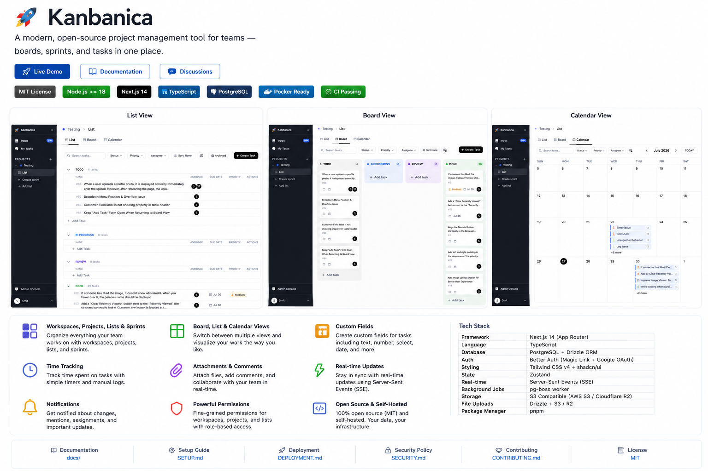

<div align="center">

# Kanbanica

**A modern, open-source project management tool for teams — boards, sprints, and tasks in one place.**

[](./LICENSE)
[](./CONTRIBUTING.md)
[](https://nextjs.org/)
[](https://www.typescriptlang.org/)
[](https://www.postgresql.org/)

</div>

---

## Overview

Kanbanica is a self-hostable, ClickUp-style project management app. Teams organize their work in **Workspaces → Projects → Lists / Sprints → Tasks**, with real-time collaboration, notifications, and a fast, keyboard-friendly UI. It's a complete, production-grade codebase you can clone, run, extend, and deploy on your own infrastructure.

## Features

- 🗂️ **Workspaces, Projects, Lists & Sprints** — a flexible hierarchy for organizing any team's work
- ✅ **Rich tasks** — assignees, due dates, priorities, subtasks/checklists, attachments, and Tiptap-powered descriptions
- 🏷️ **Custom Fields** — Text, Number, Checkbox, Single/Multi Select, Date, and Person fields scoped to a Workspace, Project, or List
- ⏱️ **Time tracking** — a live timer or manual log per task, with a per-user history
- 🏃 **Sprints** — sprint planning, story points, and automatic sprint close
- 📌 **Multiple views** — Board, List, Calendar, and a cross-workspace "My Tasks"
- 💬 **Collaboration** — comments, @mentions, reactions, and an activity feed
- ⚡ **Real-time sync** — live updates over SSE as teammates make changes
- 🔔 **Notifications** — in-app, email digests, and Web Push
- 🔐 **Two-level permissions** — workspace roles + per-project permissions, with guests
- 🔑 **Flexible auth** — magic link, Google OAuth, or email + password — all on one account
- 🎨 **Themeable UI** — light/dark, built on DaisyUI + Tailwind CSS v4
- 🛠️ **Admin panel** — user, queue, and email visibility

## Screenshots



More captures (Board, List, Sprint, Task detail, mobile) are welcome — see
[`docs/screenshots/`](./docs/screenshots/) for the list we're looking for.

## Tech Stack

| Layer | Choice |
|-------|--------|
| Framework | Next.js 16 (App Router) |
| Language | TypeScript |
| Database | PostgreSQL + Drizzle ORM |
| Auth | Better Auth (magic link / Google OAuth) |
| Styling | Tailwind CSS v4 + DaisyUI |
| Rich Text | Tiptap |
| State | SWR (server) + React state/context (client) |
| Real-time | Server-Sent Events (SSE) |
| Background Jobs | pg-boss worker |
| Email | Nodemailer (SMTP) |
| File Storage | files-sdk (local FS in dev → S3/R2 in prod) |

## Quick Start

Requires **Node.js 22** and **pnpm**. No separate database install needed — a local Postgres is bundled for development.

```bash
git clone https://github.com/sahaj-snapdevio/Kanbanica.git kanbanica
cd kanbanica
pnpm install
cp .env.example .env
pnpm db:local     # start the bundled dev database (leave running)
pnpm db:migrate   # create the tables (first time only)
pnpm dev          # start the web app + worker
```

Open <http://localhost:3000>. On a fresh database you're taken to the **first-run setup wizard** at `/setup` — enter a name, email, and password to create your administrator account and you're signed straight in. That's the whole bootstrap; no terminal step.

> Prefer another way in? Sign in with a **magic link** (printed in your terminal when no SMTP is configured), or set `ALLOW_PASSWORD_SIGNUP=true` and register at `/signup`. To make an existing account an admin, run `pnpm make:admin you@example.com`. See **[SETUP.md](./SETUP.md)** for details.

📖 Full step-by-step walkthrough (with troubleshooting): **[SETUP.md](./SETUP.md)**.

## Local Development

- `pnpm dev` runs the Next.js app **and** the pg-boss worker together.
- `pnpm lint` / `pnpm typecheck` — code quality checks.
- Architecture, conventions, and per-feature specs live in [CLAUDE.md](./CLAUDE.md) and the [`docs/`](./docs) folder.

See **[SETUP.md](./SETUP.md)** for the complete local-development guide.

## Authentication

Three login methods, all producing the same session and the same user record — **one account per email address**, however someone signs in.

| Method | Needs | Enabled |
|--------|-------|---------|
| **Magic link** | SMTP (in production) | always |
| **Google OAuth** | `GOOGLE_CLIENT_ID` + `GOOGLE_CLIENT_SECRET` | when both are set |
| **Email + password** | nothing | sign-in always; self-serve sign-up needs `ALLOW_PASSWORD_SIGNUP=true` |

Every screen renders only the methods you actually configured. In production the app refuses to start unless at least one of them is available, so login can't silently break.

**Signup behaviour depends on whether SMTP is configured** — this is the part that catches people out:

- **No SMTP** → `/signup` creates the account and signs the user straight in. No verification email, because there'd be no way to deliver one.
- **SMTP configured** → a verification email is sent, and the user can't sign in until they click the link. Verification is also what allows them to link Google to that same email later.

Passwords are 8–128 characters. `/signup` and `/forgot-password` return **404** unless password signup (and, for reset, SMTP) is enabled — so a fresh install is invite-only by default.

Full reference: **[docs/authentication.md](./docs/authentication.md)**.

## Self-Hosting

Deploy Kanbanica for your team with Docker Compose (Postgres + app + worker, one command). See the full production guide: **[DEPLOYMENT.md](./DEPLOYMENT.md)**.

```bash
cp .env.example .env   # configure DATABASE_URL, APP_SECRET, APP_URL + a login method
docker compose up -d --build
```

**Already have a PostgreSQL?** Point `DATABASE_URL` at it and add the overlay — the bundled database container is then never started. Migrations still run automatically before the app boots.

```bash
docker compose -f docker-compose.yml -f docker-compose.external-db.yml up -d
```

Any PostgreSQL 16+ reachable over the network works (company cluster, RDS, Neon, Supabase, Railway, Render, DigitalOcean, …) — there's no provider-specific code. See [DEPLOYMENT.md → external PostgreSQL](./DEPLOYMENT.md#using-an-external-postgresql).

**Email:** magic-link login works with **any SMTP provider** (Resend recommended, or Brevo/Postmark/SES/…) — configure it via env vars; see [DEPLOYMENT.md → Production email](./DEPLOYMENT.md#production-email-smtp). Each deployment uses its own credentials; nothing is committed.

**Credential setup:** need help configuring Google OAuth, SMTP, Web Push, S3, or Cloudflare R2? Step-by-step guides (where to click, which values to copy, how to verify it worked) live in **[`docs/credentials/`](./docs/credentials/)**.

## Documentation

- [SETUP.md](./SETUP.md) — local development, start to finish
- [DEPLOYMENT.md](./DEPLOYMENT.md) — self-hosting with Docker
- [`docs/credentials/`](./docs/credentials/) — step-by-step setup for Google OAuth, SMTP, Web Push, S3, and Cloudflare R2
- [ARCHITECTURE.md](./ARCHITECTURE.md) — how the system fits together
- [CLAUDE.md](./CLAUDE.md) — conventions and key decisions
- [ROADMAP.md](./ROADMAP.md) — planned features and direction
- [CHANGELOG.md](./CHANGELOG.md) — notable changes per release
- [`docs/`](./docs) — per-feature specifications (tasks, sprints, permissions, notifications, real-time, database schema, and more)

## Contributing

Contributions are welcome! Please read **[CONTRIBUTING.md](./CONTRIBUTING.md)** for setup, coding conventions, and the pull-request process, and see **[SECURITY.md](./SECURITY.md)** to report vulnerabilities responsibly.

## Why Kanbanica?

- **Own your data** — self-host on your own infrastructure; no vendor lock-in.
- **Complete, not a toy** — real workspaces, sprints, permissions, real-time sync, notifications, and an admin panel out of the box.
- **Modern stack** — Next.js 16, TypeScript, Drizzle, Tailwind v4 — approachable to extend.
- **No SaaS strings attached** — no telemetry, no billing walls, no proprietary dependencies. MIT-licensed.

## License

Kanbanica is open source under the [MIT License](./LICENSE).
